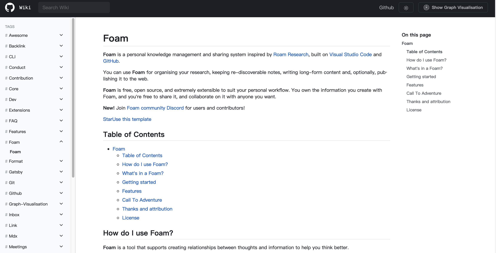
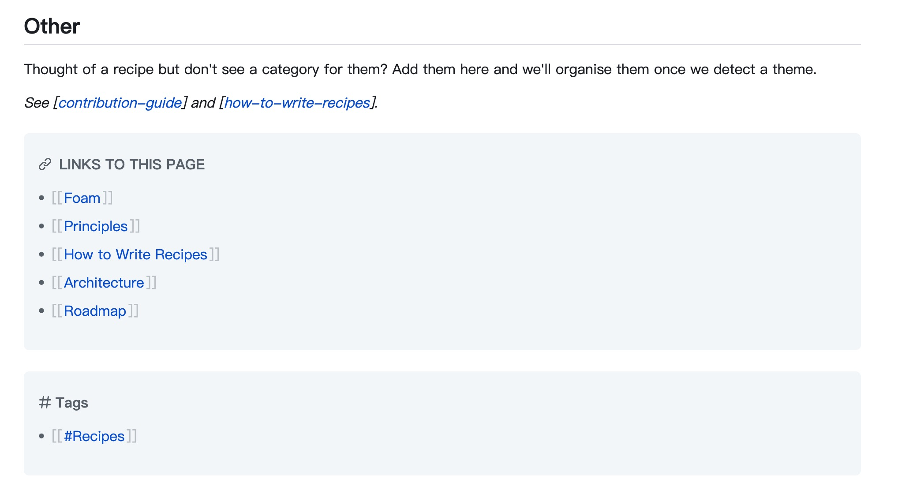
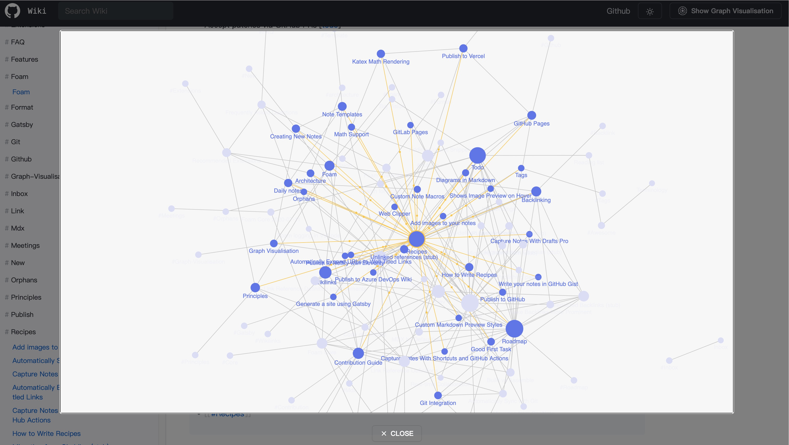
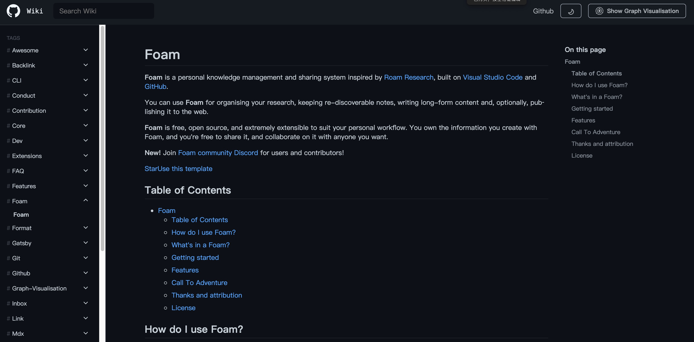

# Gatsby Theme Primer Wiki

A Gatsby Theme for Wiki/Docs/Knowledge Base, which using [Primer style](https://primer.style/react/) as the UI theme, can work well with [Foam](https://github.com/foambubble/foam) or [Obsibian](https://obsidian.md/) or just markdown files.

This theme is inspired with [gatsby-project-kb](https://github.com/hikerpig/gatsby-project-kb), [gatsby-digital-garden](https://github.com/mathieudutour/gatsby-digital-garden) and [doctocat](https://primer.style/doctocat/)

## Sites that use this theme

- [Demo](https://wiki.demo.owenyoung.com/) - ([Source](https://github.com/theowenyoung/gatsby-theme-primer-wiki/tree/main/example))
- [Everything I Know by Owen](https://wiki.owenyoung.com/) - ([Source](https://github.com/theowenyoung/wiki))

## Principles

Here are my main ideas/principles in designing this theme.

1. No vendor lock-in. So we should only write standard markdown. I like `[[WikiLink]]`, but I love standard markdown more. So we should always use standard markdown link `[text](https://example.com)`, or use [Wikilink](https://foambubble.github.io/foam/wikilinks) with [Link Reference Definitions](https://foambubble.github.io/foam/features/link-reference-definitions), and don't use any vendor locked-in feature. That give us the capability change our theme, or hosted place.
2. Use meta data instead of special characters. We should use `tags` as the document's metadata, not `#tag` at the plain text.

## Features

- Support Local search, full-text search.
- Support Graph Visualisation with canvas.
- Support Tags, Tags First
- Support [Gitbook](https://docs.gitbook.com/integrations/github/content-configuration#summary) styled `SUMMARY.md` for custom sidebar.
- Support `[[WikiLink]]`, But you'd better use [Link Reference Definitions](https://foambubble.github.io/foam/features/link-reference-definitions) with extensions, `"foam.edit.linkReferenceDefinitions": "withExtensions"`
- Support Light/Dark Theme
- Custom Header Nav Items
- Nested sidebar

## Getting Started

### With Foam template repo

### With the Gatsby starter

## Usage

### Theme Config

### nav

For header navs. Support two depth levels. Example:

```javascript
{
  nav: [
    {
      title: "Github",
      url: "https://github.com",
    },
    {
      title: "Menus",
      items: [
        {
          title: "Menu1",
          url: "https://google.com",
        },
      ],
    },
  ];
}
```

### mdxOtherwiseConfigured

Advanced, use your own mdx plugin config, See https://github.com/theowenyoung/gatsby-theme-primer-wiki/blob/main/theme/gatsby-config.js#L31-L67

### Others

```javascript
{
  nav: [],
  mdxOtherwiseConfigured: false, // advanced, use your own mdx plugin config, See https://github.com/theowenyoung/gatsby-theme-primer-wiki/blob/main/theme/gatsby-config.js#L31-L67
  extensions: [`.mdx`, ".md", ".markdown"], // supported file extensions for mdx
  imageMaxWidth: 561, // max width for image
  sidebarDepth: 0, // sidebar depth, default is 0;

  editUrl: "", // github/gitlab editurl, with prefix, example: 'https://github.com/facebook/docusaurus/edit/main/website/',
  editUrlText: "Edit this page", // edit url text
  shouldShowLastUpdated: true, // should show last updated
  shouldShowSidebarListOnIndex: true, // should show all articles at index.
  shouldSupportTags: true, // whether support tags
  rewriteUrlFileIgnore: [], // not rewrite `xxx.md`  to `xxx`
  rewriteToParentUrlFileIgnore: [], // not add parent path join for the file
  lastUpdatedTransformer: (isoString) => {
    const dateObj = new Date(isoString);
    const date = dateObj.toLocaleString("en-US", {
      day: "numeric",
      month: "numeric",
      year: "numeric",
    });
    return date;
  },
  lastUpdatedText: "Last updated on",
    },
```

## Todos

- [x] - excerpt as seo description
- [x] - support mobile instant view button
- [x] - support nav items
- [x] - support graph view
- [x] - release workflow
- [x] - readme add summary
- [x] - pathPrefix test
- [x] - qbittorrent with jackett mobile screen overflow
- [x] - support tags search
- [x] - support theme
- [ ] - Docs

## Screenshot

### Home



### Backlinks & Tags



### Graph Visualisation



### Dark Theme


